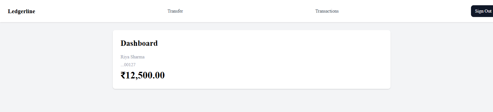
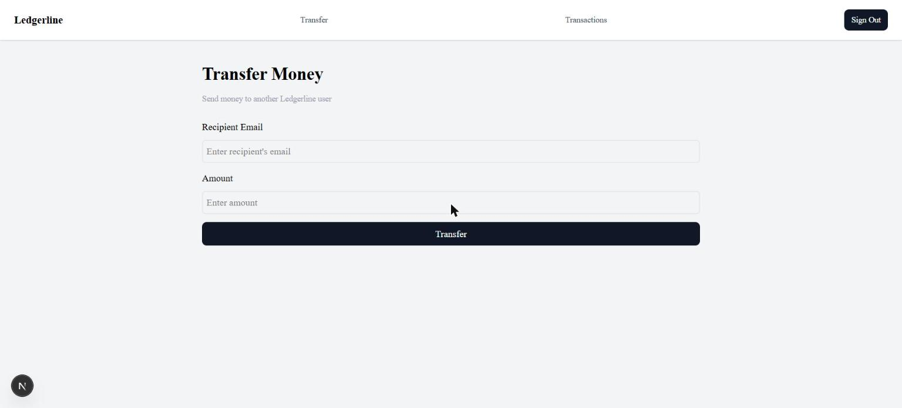
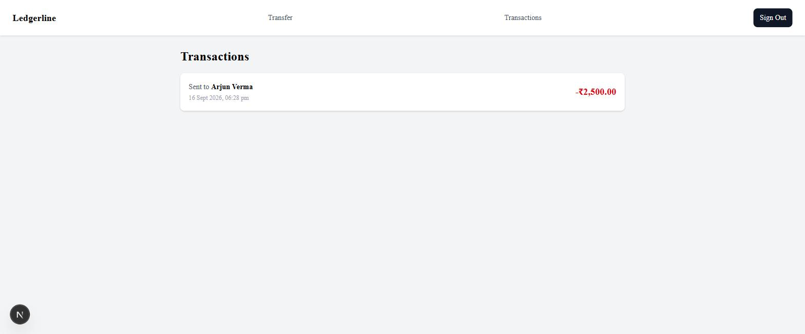

# Ledgerline

A wallet/payments app built to demonstrate concurrency-safe money transfers, idempotency, and rate limiting — with a real, clickable UI end to end, not just working endpoints.

**Live demo:** https://ledgerline-green.vercel.app

**Screenshots:**

| Dashboard | Transfer | Transaction history |
|---|---|---|
|  |  |  |

## What it does

- Sign up, sign in, sign out — JWT access tokens + rotating refresh tokens in httpOnly cookies, with silent token refresh so an expired access token never boots you back to the login screen mid-session.
- See your wallet balance on a dashboard, fetched server-side.
- Transfer money to another user by email — validated, rate-limited, and safe to retry (double-clicking, or a flaky network retry, never executes the transfer twice).
- Browse your transaction history with infinite scroll, safe against duplicates or gaps even while new transactions are being created concurrently in another tab.
- Every failure mode (insufficient balance, invalid recipient, expired session, rate limit) shows a clear, specific message — inline on the relevant field, as a whole-form banner, or as a toast, never a blank screen or raw error text.

## Tech stack

- **Next.js 16** (App Router, Turbopack) + TypeScript
- **PostgreSQL** (Neon) + **Prisma 7** (driver adapter, `prisma-client` generator)
- **Upstash Redis** — idempotency keys and sliding-window rate limiting
- **JWT** (jsonwebtoken) + **bcrypt** — custom auth, no third-party auth provider
- **Zod + react-hook-form** — one schema per form, shared between client-side `zodResolver` validation and server-side route-handler validation
- **TanStack Query** — `useInfiniteQuery` for the transaction list
- **shadcn/ui + Tailwind CSS** — toast notifications
- **Vitest** — concurrency unit tests on the transfer logic, against a real database
- **Playwright** — end-to-end test covering the full signup → transfer → balance-update → transaction-list loop

## Setup

```bash
git clone <repo-url>
cd ledgerline
npm install
cp .env.example .env   # fill in real values — see below
npx prisma generate
npx prisma migrate dev
npm run dev
```

Open [http://localhost:3000](http://localhost:3000).

### Environment variables

See `.env.example` for the full list with comments on where each is used. You'll need:
- A Postgres database (a free [Neon](https://neon.tech) project works well) — both a pooled and unpooled connection string.
- An [Upstash Redis](https://upstash.com) database (free tier is enough) for its REST URL and token.
- Two random secrets for JWT signing (`openssl rand -base64 32`, run twice).

### Running tests

```bash
npm run test        # Vitest — concurrency/locking logic against a real dev database
npm run test:e2e    # Playwright — full browser e2e flow
```

## Key engineering decisions

**1. Every balance mutation goes through one primitive, and it's built to survive concurrency.** `executeTransfer` runs inside a single Postgres transaction, acquiring both wallets' rows with `SELECT ... FOR UPDATE` in a *consistent order* (always the lower wallet ID first, regardless of which side is sender or receiver) — this is what prevents two simultaneous transfers between the same pair of wallets from deadlocking each other. On top of that, a client-generated idempotency key is checked against Redis before the transfer runs, so a double-click or a retried request can never execute twice. Both guarantees are covered by Vitest tests that fire genuinely concurrent requests (`Promise.all`/`Promise.allSettled`) against a real database, not mocks — because the whole point is testing real row-lock behavior, which a mock can't meaningfully verify.

**2. Server Components by default; Client Components only where interactivity actually requires them.** The dashboard balance is fetched directly from the database in a Server Component and streamed as HTML — no client-side spinner for the single most important number on the page. The transfer form, by contrast, is a Client Component, since it's inherently interactive (form state, validation feedback, a client-generated idempotency key that must survive a failed submit and only regenerate on success). The transaction list splits the difference: the first page renders server-side for a fast initial paint, and a Client Component takes over from there for infinite scroll via `useInfiniteQuery`.

**3. A consistent API error shape, closing a real bug rather than just adding polish.** Every route returns `{error: string, fieldErrors?: Record<string, string[]>}`. This wasn't just a nice-to-have — the original code had validation failures return Zod's raw flattened-error object directly as `error`, which every form's `<p>{formError}</p>` would have tried to render as a string, throwing "Objects are not valid as a React child" the moment server-side validation ever actually caught something client-side validation didn't. Standardizing the shape fixed a live crash bug, not just tidied up the response format.

## Known limitations

- **No way to fund a wallet through the UI.** Every account starts at ₹0; there's no deposit/top-up flow. (Stripe integration for this was considered and deliberately scoped out — it belongs to a different, later project's actual payment flow, not bolted onto this one at the last minute.)
- **No `status` field on the transaction ledger.** Every row that exists is implicitly "completed," since `executeTransfer` only ever writes a row inside a fully-successful, atomic database transaction — there's no code path that could produce a "pending" or "failed" row. Adding the field now would be schema churn with no behavioral change.
- **Recipient search is a plain email field, not search-as-you-type.** A debounced, backend-powered search was considered; scoped out deliberately for MVP speed given the time budget, in favor of finishing correctness-critical work (locking, idempotency, testing) first.
- **No admin view.** Not useful for a single-operator demo project — its only real value would be as an interview talking point, which didn't justify the build time here.

## Future improvements

- A debounced recipient search, per above.
- An in-app "you received ₹X" notification (would need a polling or push mechanism — deliberately deferred, more involved than it first looks).
- A wallet top-up flow.
- Full accessibility pass (currently relies on semantic HTML and shadcn's built-in accessibility, not an audited pass).
